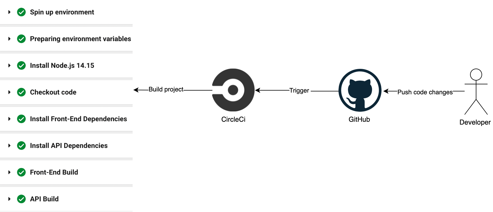

## Udagram Pipeline Process

### Continuous Integration

#### GitHub
The flow starts with the developer pushing his/her changes to GitHub repository.
The code push triggers CircleCI 

#### CircleCI
CircleCI reads the `config.yml` file in `.circleci` folder, which instructs the service to perform the build activities in our case the front and back ends. 