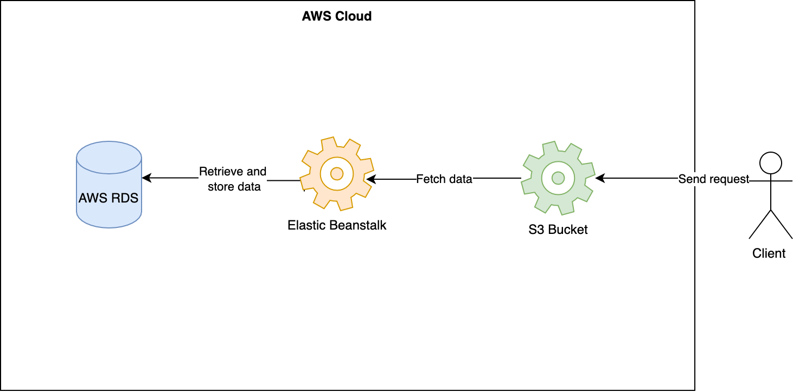

## Udagram Infrastructure

### AWS:

#### S3 Bucket
AWS S3 Bucket is used to deploy the frontend application which makes it publicly accessible.

Bucket URL: `http://sarahudagrambucket.s3-website-us-east-1.amazonaws.com`

#### Elastic Beanstalk
The application server is hosted on AWS Elastic Beanstalk. Elastic Beanstalk extracts and executes the application on an endpoint once it is built, archived, and uploaded to an S3 bucket.

URL: `http://aws-circle-ci-api.eba-wgzep7cy.us-east-1.elasticbeanstalk.com/`

#### RDS database running Postgres
The application server uses the AWS RDS Postgres database for storing and retrieving data

Endpoint: `database-1.cr6aoymsqie2.us-east-1.rds.amazonaws.com`
Port: 5432
